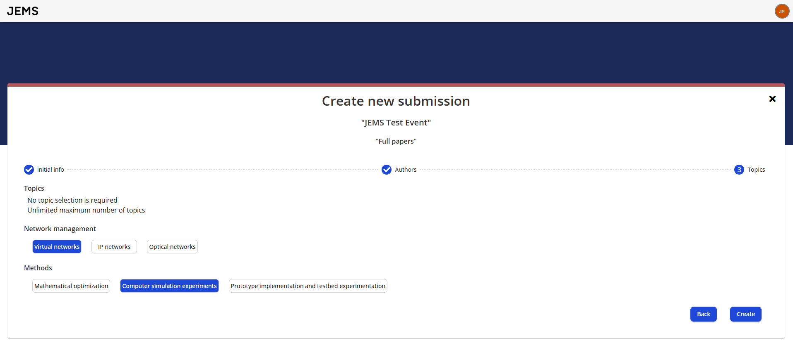
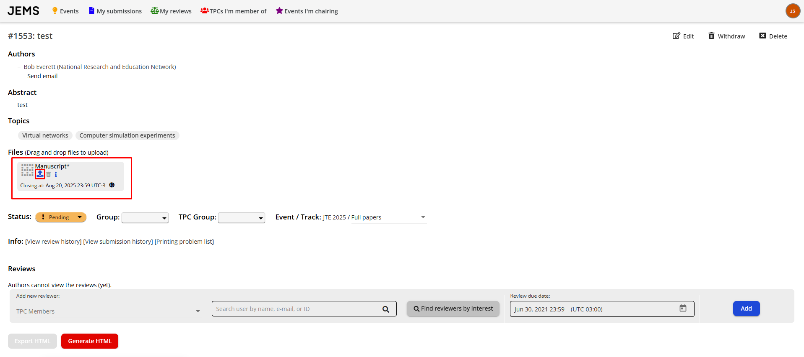

### Ajuda Para Autores de Artigos
_________
Esta página orienta os autores de artigos de eventos registrados no JEMS.

Após registrar-se no sistema, qualquer usuário pode registrar artigos em conferências que aceitam registro de artigos. A lista de conferências que aceitam registros é exibida na página _Eventos_ ou na página principal do JEMS após o login. Para submeter artigos, o usuário deve seguir os seguintes passos:

1. Clique no nome do evento para o qual deseja submeter um artigo na página de Eventos. Isso irá redirecioná-lo para a página inicial do evento no JEMS.
2. Na página específica do evento, selecione a trilha de submissão apropriada e clique no botão com o rótulo "Submit".
3. Preencha as informações do artigo no formulário de registro:
   - **Informações iniciais**: Informe o título e o resumo da submissão;
   - **Autor**: o sobrenome do autor ou e-mail conforme registrado no JEMS. Todos os autores do artigo devem estar registrados no JEMS antes da submissão do artigo;
   - **Tópicos**: selecione os tópicos apropriados para o artigo;

4. Clique no botão **Submit** e você verá a confirmação do registro do seu artigo;

5. Faça o upload do arquivo dentro da página da submissão. Clique no **ícone de upload** para enviar o arquivo contendo seu artigo. Os formatos aceitáveis para o arquivo são definidos pelo chair da conferência, por exemplo, PDF, PS ou DOC. Você também pode fazer o upload do manuscrito posteriormente, veja abaixo.

________________________________
### Perguntas Frequentes para Autores

- **Como Fazer Upload do Manuscrito do Artigo**: acesse o menu "_Minhas submissões_" ou a página inicial da conferência no JEMS e você verá a lista de suas submissões. Clique no título da submissão que deseja enviar e procure pelo ícone de upload na tabela de arquivos.

- **Como Incluir Arquivos Extras na Minha Submissão**: O chair do evento pode definir arquivos extras que também devem ser enviados durante a submissão, por exemplo, arquivos de vídeo e apresentação. Isso deve ser feito seguindo o mesmo procedimento descrito acima para o upload do manuscrito.

- **Como Ver o Status da Minha Submissão**: Você pode verificar a qualquer momento o status da sua submissão no JEMS (acesse **Minhas Submissões**) para ver se está em revisão ou se foi aceita/rejeitada.

- **Onde Posso Ver as Avaliações da Minha Submissão**: Quando disponibilizadas pelo Chair, as avaliações da submissão podem ser visualizadas logo abaixo da tabela que exibe as informações da sua submissão.

- **Como Posso Escrever uma Réplica (Rebuttal)**: Réplica é um texto escrito pelos autores do artigo apresentando seus contra-argumentos aos avaliadores da submissão. Essa opção nem sempre é utilizada pelos chairs do evento. Caso o chair decida utilizar, a opção para escrever a réplica estará disponível no final da página que mostra as informações da sua submissão no JEMS, logo abaixo das avaliações da submissão.

- **Como Faço o Upload da Versão Final (Camera-Ready) da Minha Submissão**: Normalmente, os manuscritos finais (camera-ready) são enviados no sistema como arquivos extras e devem ser enviados na página que mostra as informações do artigo. Procure nessa página pelo ícone de upload.
