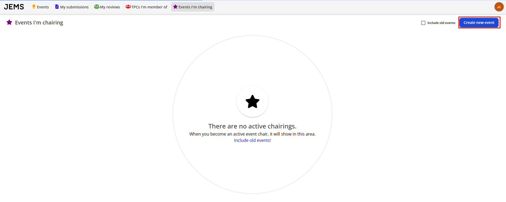
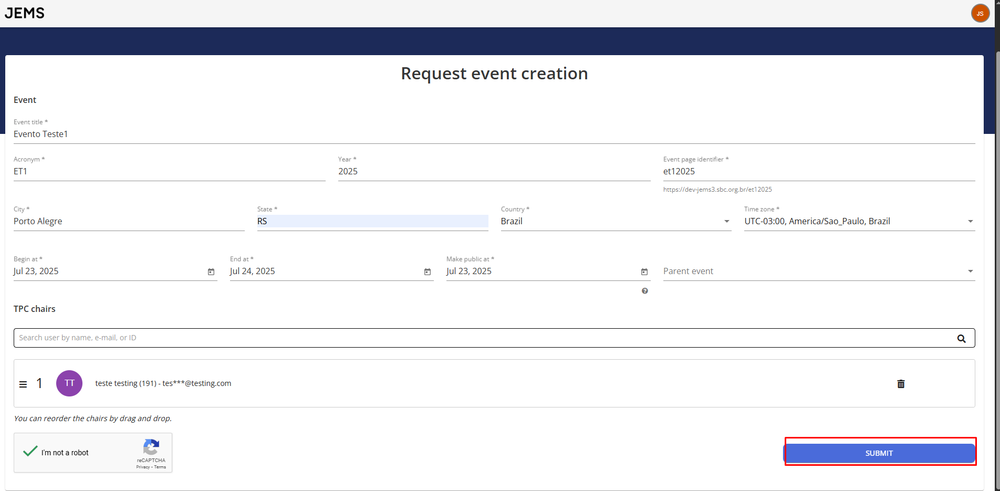
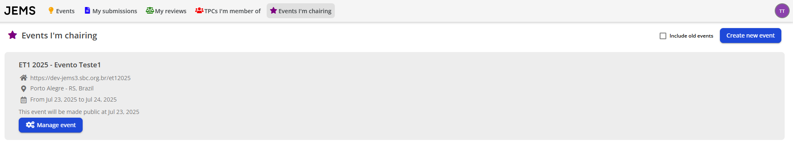

Para criar um novo evento no JEMS3, faça o seguinte:

1. Solicite um novo evento acessando _Eventos que Estou Presidindo > Solicitar Novo Evento_:

2. Preencha todos os campos obrigatórios com informações sobre seu evento e clique em "Submit":

Uma vez aceito, seu evento aparecerá na seção Presidindo do menu _Eventos que Estou Presidindo_.

Próxima fase: **[Fase de Submissão de Artigos](https://github.com/ComputerNetworks-UFRGS/jems3-wiki/wiki/Paper-Submission)**
