A fase de revisão de artigos possui os seguintes passos de configuração:

1. Configurar a revisão:

A revisão pode ser configurada em _Reviews > Configuration_.

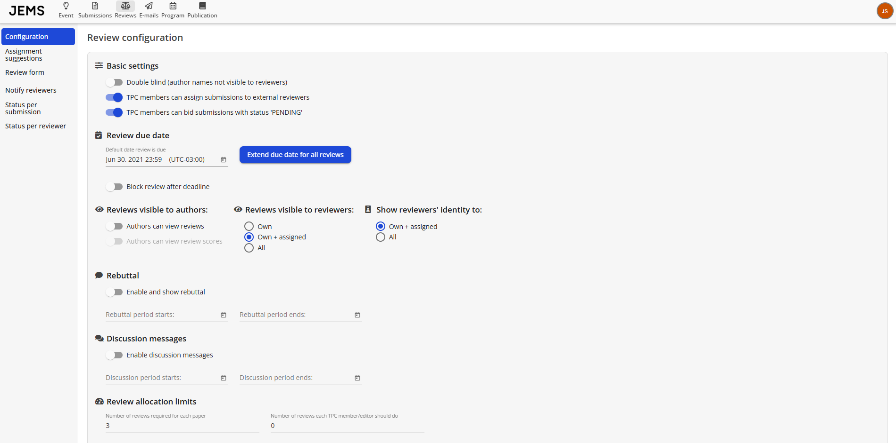
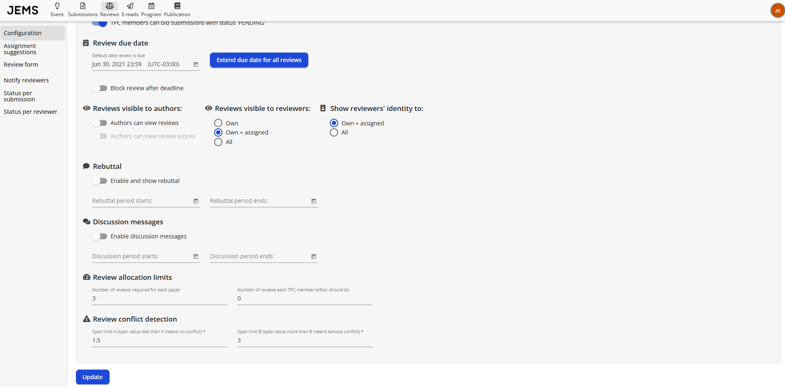

* PRAZO (DEADLINE): data esperada para o envio das revisões.
* BLOQUEAR REVISÃO, REVISORES NÃO PODEM EDITAR A REVISÃO: permite bloquear/desbloquear revisões.
* ANÔNIMO: controla se um membro do TPC/editor pode ver as identidades dos outros revisores de um artigo. Por padrão, se o chair do TPC for autor de um artigo, as identidades dos revisores são anonimizadas.
* VISUALIZAÇÃO: controla se um membro do TPC/editor pode ver apenas suas próprias revisões, as revisões que ele atribuiu a outros ou todas as revisões. Também é possível permitir que autores vejam as revisões. Isso é importante caso o evento tenha uma fase de réplica.
* ATRIBUIÇÃO E RECLAMAÇÃO DE SUBMISSÕES: controla se o membro do TPC/editor pode atribuir revisões a revisores que não são membros do TPC e se o membro do TPC pode reclamar submissões com status 'PENDENTE'.
* RESOLUÇÃO DE CONFLITOS NA REVISÃO: com base nas revisões, o JEMS calcula o _span_ de um artigo. O span é a diferença entre a maior e a menor nota do artigo. Um span grande indica conflito. É possível definir dois limites de span (A e B). Valores de span entre A e B indicam conflito. Valores maiores que B indicam conflito sério.
* PROCESSO DE REVISÃO: define o número de revisões necessárias por artigo e o número de revisões que cada membro do TPC deve completar.
* RÉPLICA: permite configurar o período para a réplica.
* MENSAGEM DE DISCUSSÃO: permite configurar o período para discussão.

Após configurar, clique em "Save".

2. Configurar o formulário de revisão:

O formulário de revisão pode ser acessado em _Reviews > Review form_. Para editar, clique em "Edit".

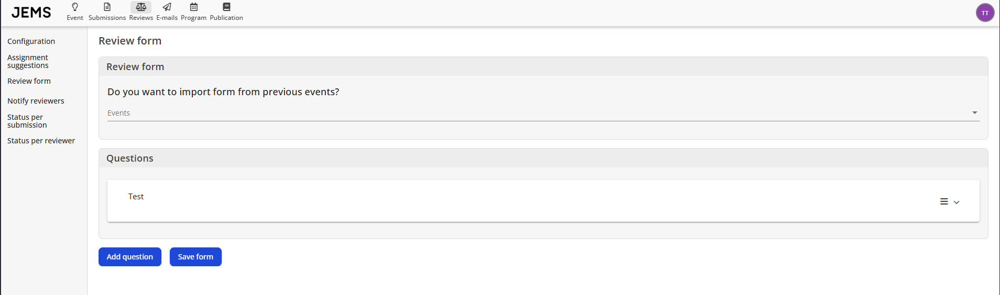

Perguntas podem ser adicionadas, modificadas ou removidas do formulário de revisão. Alternativamente, você pode importar perguntas de outros eventos. As perguntas podem ter três formatos: checkbox, botões de opção (radio buttons) ou texto.

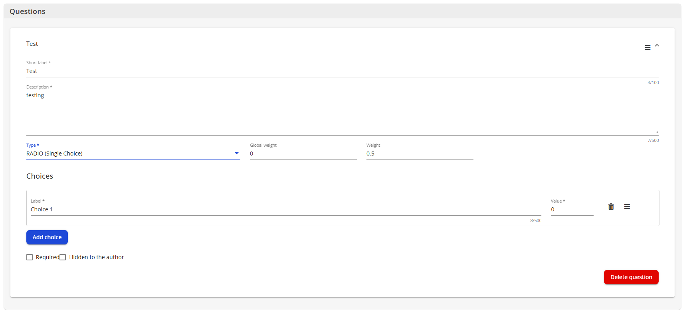

Para checkbox e botões de opção, você deve definir dois parâmetros: Peso Global (Global Weight) e Peso (Weight). A soma de todos os pesos globais deve ser 1 (um) ou 0 (zero). Esses pesos são usados para calcular a média e a média global (ponderada) do artigo, que pode ser usada para ranquear os artigos. A média e a média global de um artigo são calculadas da seguinte forma:

* Média (Avg) = soma(media(i))/N, onde i: {1..N}, e N é o número de revisões do artigo
* Média Global (GAvg) = soma(media(i)*peso(i))/soma(peso(i)), onde i: {1..N}, e N é o número de revisões do artigo

A média e o peso da i-ésima revisão são dados por:

* media(i) = soma(score(j)/max_score * peso_pergunta(j) * 10), onde j: {1..M}, e M é o número de perguntas com nota na revisão i
* peso(i) = soma(score(j)/max_score * peso_global_pergunta(j)), onde j: {1..M}, e M é o número de perguntas com nota na revisão i

As variáveis peso_pergunta(j) e peso_global_pergunta(j) são definidas no formulário para cada pergunta.

Exemplo:

Suponha que o formulário de revisão tenha 3 perguntas configuradas da seguinte forma:

Número  | Pergunta       | Notas | Peso  | Peso Global
------- | -------------- | ------| ------| -------------
1       | ORIGINALIDADE  | 1-5   | 0.5   | 0.0
2       | RECOMENDAÇÃO   | 1-5   | 0.5   | 0.0
3       | CONFIANÇA      | 1-5   | 0.0   | 1.0

E as revisões foram preenchidas assim:

Perguntas | 1 | 2 | 3
----------|---|---|---
Revisor 1 | 4 | 4 | 3
Revisor 2 | 5 | 5 | 5
Revisor 3 | 5 | 5 | 5

A média e o peso de cada revisão são calculados por:

media(1) = (4/5 * 0.5 + 4/5 * 0.5 + 3/5 * 0.0) * 10 = 8

media(2) = (5/5 * 0.5 + 5/5 * 0.5 + 5/5 * 0.0) * 10 = 10

media(3) = (5/5 * 0.5 + 5/5 * 0.5 + 5/5 * 0.0) * 10 = 10

peso(1) = (4/5 * 0.0 + 4/5 * 0.0 + 3/5 * 1.0) = 0.6

peso(2) = (5/5 * 0.0 + 5/5 * 0.0 + 5/5 * 1.0) = 1.0

peso(3) = (5/5 * 0.0 + 5/5 * 0.0 + 5/5 * 1.0) = 1.0

Revisão | Média | Peso
--------|-------|------
1       | 8     | 0.6
2       | 10    | 1.0
3       | 10    | 1.0

Logo,

Avg = (8 + 10 + 10) / 3 = 9.33

GAvg = (8 * 0.6 + 10 * 1.0 + 10 * 1.0) / (0.6 + 1.0 + 1.0) = 9.53

No exemplo, o Revisor 1 deu a menor nota, mas essa revisão tem a menor influência na Média Global do artigo, pois a nota da pergunta 3 (Confiança) é menor que a dos outros dois revisores.

Após editar o formulário, clique em "Save Form" para salvar as alterações.

3. Ajustar os templates de e-mail relacionados à fase de revisão:

Vá para _E-mails > Email Templates_. Existem 11 templates que podem ser configurados. Alguns são mostrados na figura:

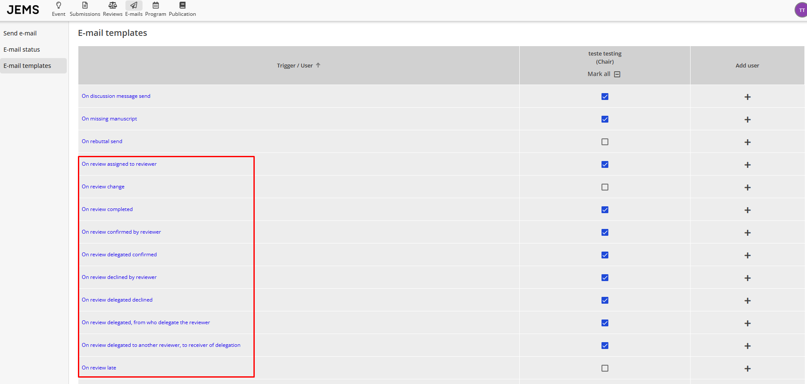

4. Adicionar ou convidar membros do TPC:

Membros do TPC podem ser convidados ou adicionados diretamente à lista do TPC. Para adicionar um membro, vá em _Event > People > TPC Members_ e busque por membros já registrados no JEMS. Opcionalmente, um novo usuário pode ser criado e adicionado ao TPC.

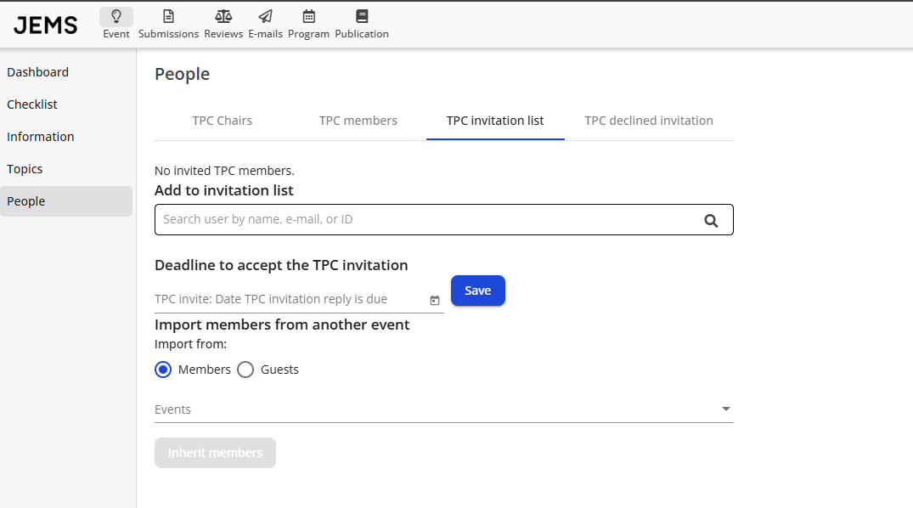

Alternativamente, membros do TPC podem ser adicionados a uma lista de convites. Para isso, pesquise usuários existentes na barra de busca correspondente (ou crie um novo usuário). Uma lista de convites também pode ser herdada de outro evento.

Após definir a lista de convites, selecione os membros que receberão o e-mail de convite e clique em "Send" conforme mostrado na figura.

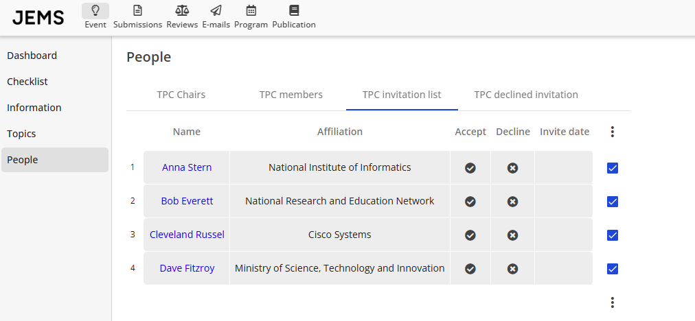

5. Atribuir revisões aos membros do TPC:

Revisões podem ser atribuídas em _Reviews -> Assignment Suggestions_. Você pode selecionar a trilha, um grupo de artigos (ou todos), e um grupo de membros do TPC (ou todos). Também pode indicar valores altos (ou baixos) de _afinidade_ para aumentar (ou diminuir) a chance de uma sugestão ser feita com base na correspondência entre os tópicos de interesse do revisor e os tópicos definidos nas submissões. Para gerar uma sugestão, clique em "Generate Suggestion".

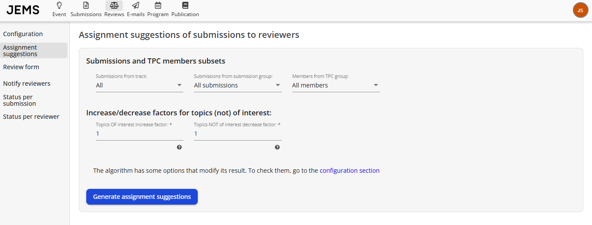

O JEMS possui um [algoritmo de sugestão de atribuição](https://github.com/ComputerNetworks-UFRGS/jems3-wiki/wiki/TPC-Chair-Additional-Information) que considera condições como:

* O revisor (membro do TPC) fez bid/reclamou o artigo
* O artigo ainda não está atribuído ao revisor
* O revisor não é autor do artigo
* O revisor não está na lista de conflito de nenhum autor do artigo

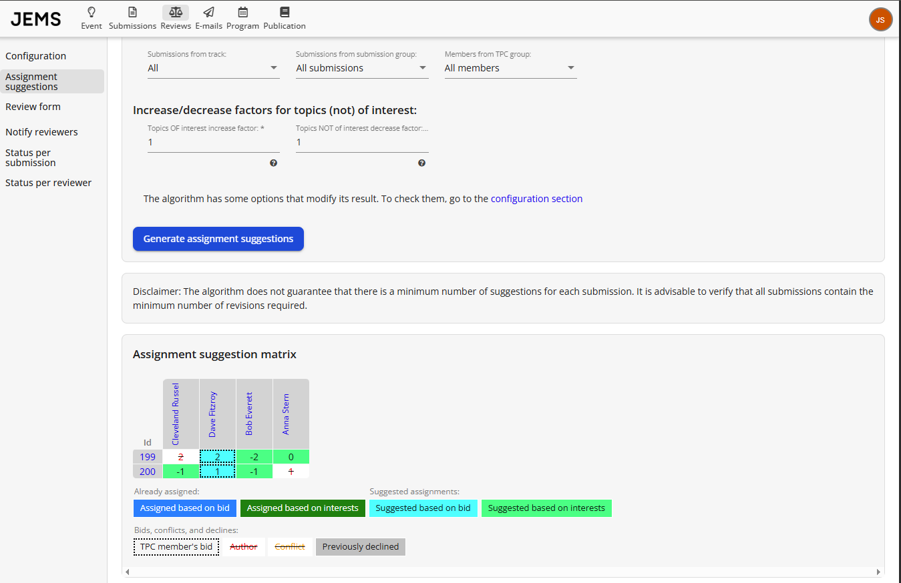

Você pode refinar manualmente as sugestões feitas pelo JEMS selecionando os revisores para cada artigo. Após as alterações, clique em "SAVE".

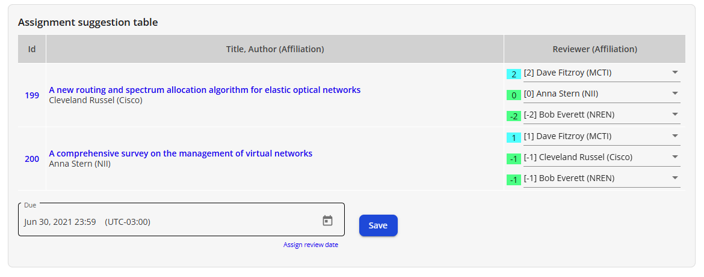

6. Notificar revisores

Após as revisões serem atribuídas, os revisores devem ser notificados. Para isso, vá em _Reviews > Notify Reviewers_. O JEMS lista os revisores que foram atribuídos, mas ainda não foram notificados. Revisores que foram atribuídos para revisar artigos que são (co)autoria do chair do TPC são mostrados como "Revisor Anônimo". Os e-mails de notificação são gerados usando os templates definidos no passo 3. Para notificar, clique em _Notify reviewers_. Cada revisor da lista receberá um e-mail conforme o template.

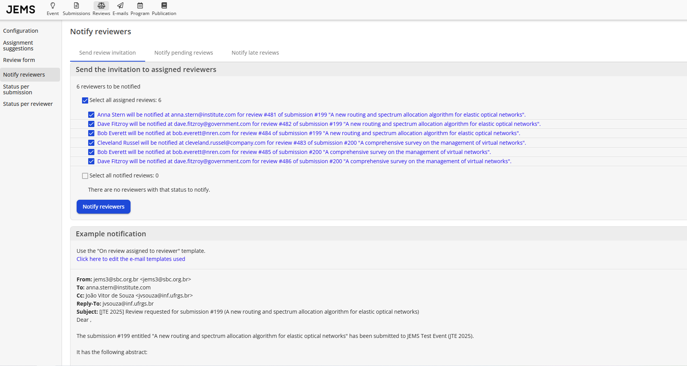

Revisores também podem ser notificados para revisões pendentes, ou seja, não finalizadas mas dentro do prazo, ou para revisões atrasadas. O processo de revisão pode ser acompanhado pelas funções _Reviews > Status per submission_ e _Reviews > Status per user_:

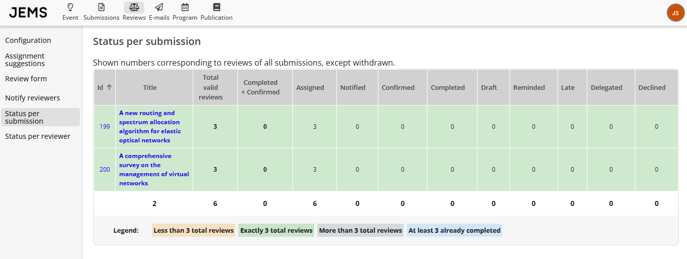

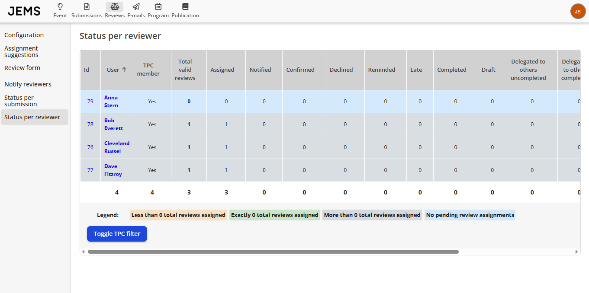

Próxima fase: **[Fase de Réplica e Discussão](https://github.com/ComputerNetworks-UFRGS/jems3-wiki/wiki/Rebuttal-and-Discussion-Phase)**
