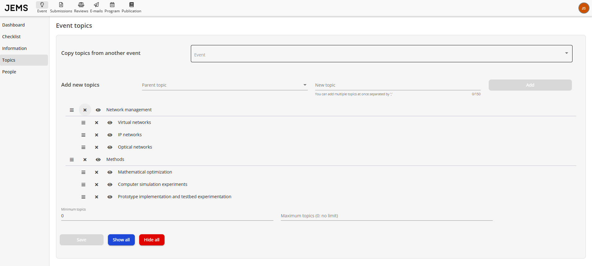
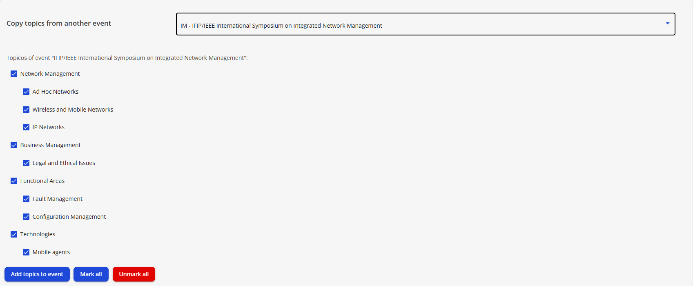
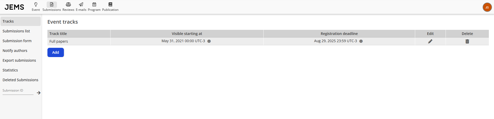
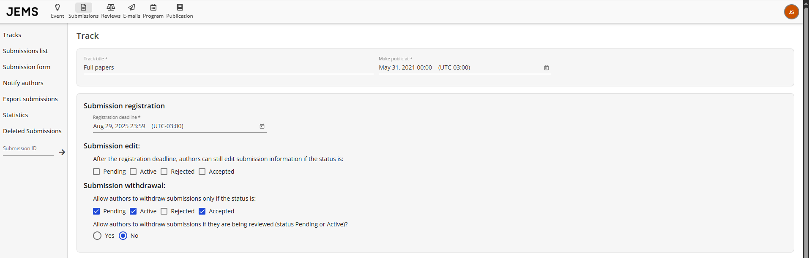
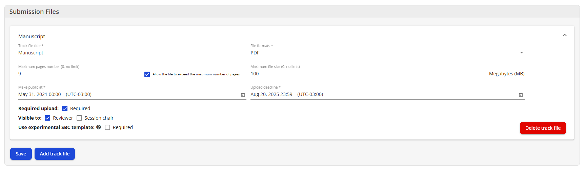
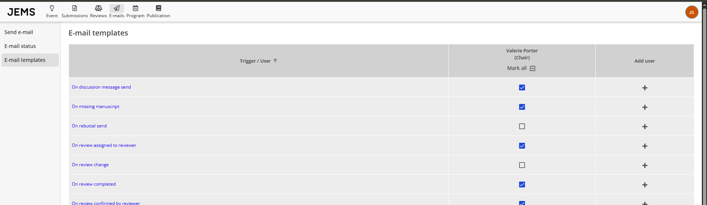
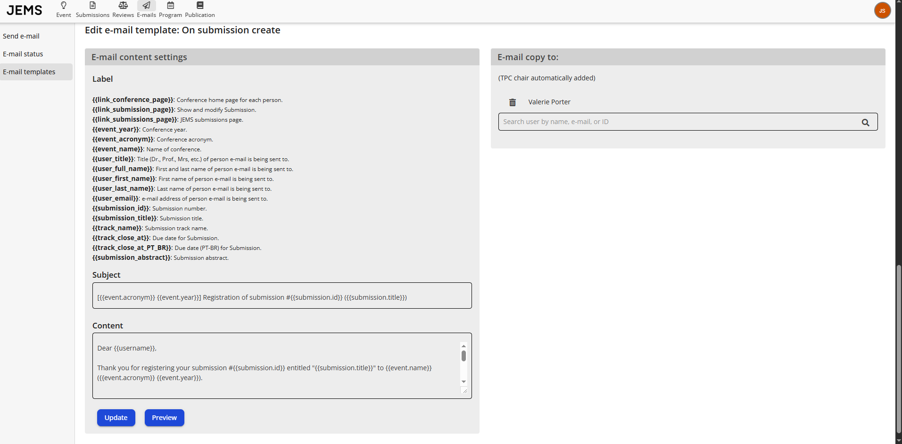
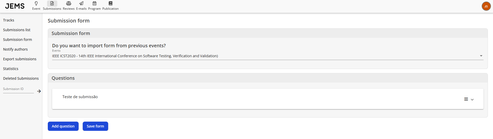

Após acessar seu evento no menu Events I'm Chairing, você pode editar a configuração básica necessária para abrir a submissão de artigos. Para isso, clique em "Manage Event" e siga os passos abaixo:

1. Defina os tópicos da conferência em _Event > Topics_:

Você pode definir categorias e, em cada categoria, diferentes tópicos. Categorias podem ser vistas como tópicos _pai_ e podem ser criadas adicionando um novo tópico e deixando o campo _Category_ em branco. Tópicos são criados de forma similar, mas uma categoria deve ser selecionada no campo _Category_. Clique em "Save" para salvar os tópicos.

OBS: apenas tópicos podem ser selecionados para submissão (categorias não podem ser selecionadas).

Você também pode herdar tópicos de outros eventos selecionando o evento no menu suspenso e então escolhendo os tópicos desejados como mostrado na figura.

OBS: membros do TPC (revisores) podem selecionar seus tópicos de interesse. Os tópicos de interesse determinarão quais artigos o revisor poderá manifestar interesse em revisar e influenciarão o algoritmo de sugestão de atribuição do JEMS.

2. Configure as trilhas e datas em _Submissions > Tracks_:

Uma trilha define um conjunto de artigos agrupados segundo algum critério. Um evento pode ter múltiplas trilhas. Por exemplo, um evento pode ter uma trilha principal, uma trilha de pôsteres, uma trilha de demonstração, uma trilha de workshop, entre outras. Para adicionar uma nova trilha, clique em "Add".

Na próxima tela você pode definir o nome da trilha e as datas de "Open At" e "Close At". Essas datas definem o período que a trilha permite registro e edição (informações, não arquivos) das submissões. Além disso, é possível configurar regras adicionais sobre edição e retirada de submissões.

Em seguida, você pode definir os _Track Files_ que permitirão aos autores submeter arquivos para a trilha correspondente. Você pode configurar as informações de cada Track File, definindo nome, formato do arquivo (PDF, DOC, HTML, entre outros), número máximo de páginas, tamanho máximo, período de abertura e fechamento — "Open At" indica quando o arquivo da trilha ficará visível para autores e "Close At" define o prazo final de submissão desse arquivo. Após preencher, clique em "Save".

Você pode adicionar quantos arquivos de trilha quiser (ex: um para submissão regular e outro para a versão final Camera-Ready) ou deletar arquivos de trilha. Quando terminar, clique em "Save Track Files".

Por fim, os chairs podem criar checklists para cada trilha, definindo para quem ela será visível e modificável.

3. Ajuste os templates de email em _Settings > Email Templates_:

Há diversos templates de email configuráveis nessa página. Alguns deles são mostrados na figura. Clicando em um template, você será direcionado para editar seu conteúdo. O template já vem com um conteúdo padrão.

O template de email usado para informar autores sobre a criação de uma submissão é mostrado na figura.

Usuários podem ser incluídos/removidos da lista de CC em cada template. Usuários na lista de Chairs são automaticamente incluídos como CC.

4. Configure o formulário de submissão em _Submissions > Submission Form_:

Opcionalmente, você pode criar um formulário de submissão para coletar informações adicionais da submissão. O formulário pode ser importado de outros eventos ou criado do zero. As perguntas podem ser do tipo checkbox, rádio ou texto. Também há opções para tornar perguntas obrigatórias e/ou escondê-las dos autores. Como antes, é possível importar perguntas de outro evento. Quando terminar, clique em "Save form".

Próxima fase: **[Fase de Revisão de Artigos](https://github.com/ComputerNetworks-UFRGS/jems3-wiki/wiki/Paper-Review)**
