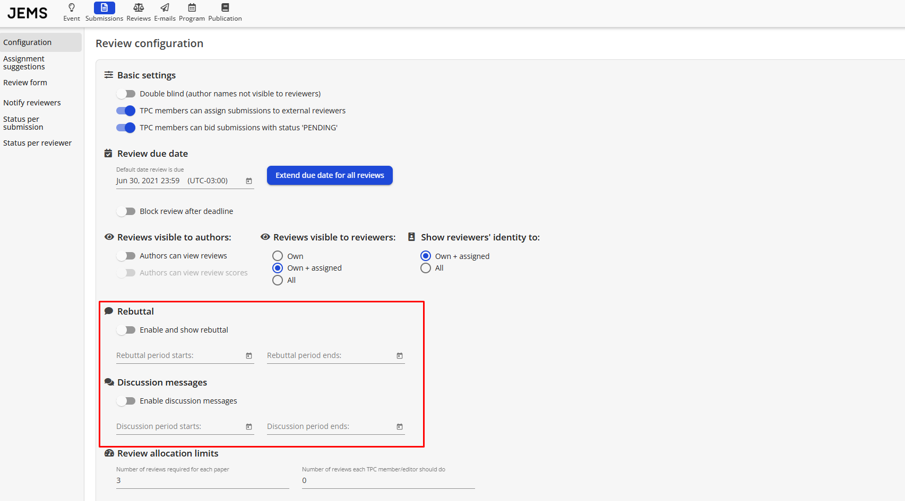

"Rebuttal" é um texto que os autores escrevem para argumentar contra os pareceres dos revisores. O período de discussão é uma opção que o sistema oferece para que os revisores troquem mensagens. Essas opções são opcionais e a ideia é que, após os revisores terminarem as avaliações, os autores possam ver os pareceres e escrever um texto (rebuttal) tentando defender seu artigo contra as críticas. Depois que o autor escreve o rebuttal, os revisores podem visualizar, discutir trocando mensagens pelo sistema — que podem ser anônimas — e então tentar chegar a um consenso (esse é o período de discussão). Esse é o procedimento seguido por alguns chairs, mas também é possível, por exemplo, usar o período de discussão para que os revisores discutam entre si os pareceres sem um "rebuttal".

Os autores das mensagens da discussão são os revisores, mas as mensagens não são identificadas. É possível mostrar a identidade dos outros revisores, mas não quem exatamente escreveu cada mensagem. A pessoa pode sempre assinar a mensagem, mas se não quiser, ela pode ser anônima. Claro que, no caso de um artigo que tenha apenas 2 revisores, eles saberão quem escreveu, mas com 3 ou mais revisores eles nunca saberão qual dos outros escreveu a mensagem, mesmo sabendo a identidade dos revisores.

Em resumo, o que acontece é:

1. Os chairs abrem as avaliações para os revisores (anônimas ou não);
2. Os chairs abrem o período de discussão;
3. Os revisores discutem, se acharem necessário (por meio de mensagens), e os chairs podem acompanhar as mensagens;
4. Os revisores podem alterar suas avaliações durante esse tempo caso cheguem a um consenso via discussões.

Quando o período de discussão é aberto, os revisores **não são notificados automaticamente**; o chair do evento deve avisar os revisores que é possível discutir os pareceres. Isso pode ser feito de duas formas:

1. Enviando um e-mail pelo menu _Events I'm Chairing > Manage Event > People > Send email_ para todos os revisores de todos os artigos, indicando que podem discutir os peer reviews se acharem necessário;
2. Enviando uma mensagem inicial de discussão nos artigos que têm pareceres conflitantes. Artigos com pareceres conflitantes podem ser identificados pela informação de Span, disponível como filtro em _Events I'm Chairing > Manage Event > Submissions_.

Para habilitar o Rebuttal e a Discussão, basta acessar:

* _Events I'm Chairing > Manage Event > Reviews > Configuration_;

Você pode ativar a opção Rebuttal/Discussion e definir o período (início e fim) para o rebuttal/discussão.

Também é possível permitir que os autores visualizem as avaliações em _Reviews > Configuration > Visualization > Authors can view reviews_

Próxima fase: **[Fase de Seleção e Notificação dos Artigos](https://github.com/ComputerNetworks-UFRGS/jems3-wiki/wiki/Selection-Phase)**
