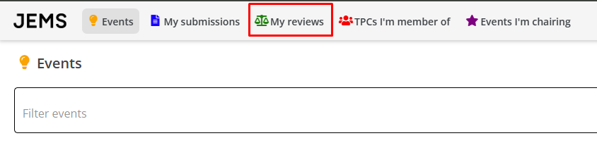
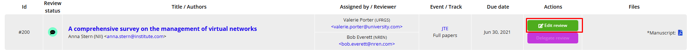

### Ajuda para Revisores de Artigos
_____
Esta página orienta os revisores de artigos de eventos cadastrados no JEMS.

- Acesse **My Reviews** para ver a lista de revisões que lhe foram atribuídas.

- Após ser convidado para revisar uma submissão no JEMS (status _Notified_), você pode acessar a página da submissão clicando no título da submissão na página **My Reviews** para aceitar ou recusar o convite.    
- Depois de aceitar o convite para revisar, você terá acesso às informações da submissão e aos arquivos (manuscrito) enviados pelos autores na página da submissão.
- Clique no ícone **Edit** para visualizar o formulário de revisão e realizar sua avaliação.

- Para concluir sua revisão, clique no botão **Submit** no final do formulário de revisão.
