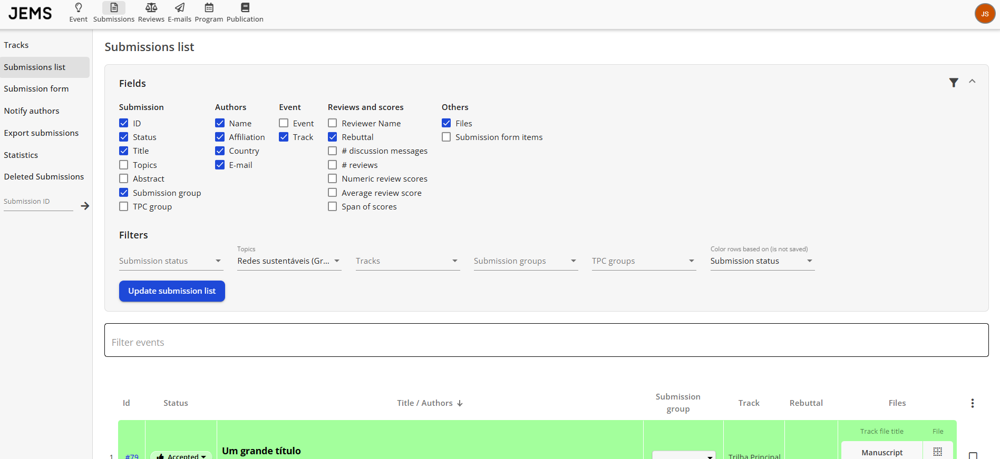

Para selecionar artigos, os chairs geralmente consultam a lista em _Events I'm Chairing > Manage Event > Submissions_. Aqui, os chairs podem aplicar diferentes filtros na lista de artigos submetidos e editar suas informações.  
Quando a lista é solicitada, é possível ordenar os artigos pela média das notas ("Avg." ou "Gavg"), onde os artigos com média mais alta representam os que receberam as melhores avaliações dos revisores. As médias são calculadas usando os valores das notas das avaliações dos artigos e os pesos configurados no formulário de revisão. Lembre-se que os pesos do formulário de revisão podem ser alterados mesmo após as revisões terem sido concluídas, mas os demais itens não devem ser modificados.

Gostaria que a mensagem de aceite do artigo e dos tutoriais, por exemplo, fosse diferente?  
Para notificar artigos de diferentes tracks ou categorias, você pode proceder da seguinte forma:

1. Vá ao menu Notify Authors. Aqui, você pode ver todos os artigos e seus status atuais (aceito/rejeitado);
2. Selecione os artigos que deseja notificar;
3. Clique em "Click here to edit the e-mail template to be used";
4. Selecione o tipo de e-mail da lista;
5. Atualize o template e volte para o menu Notify Authors;
6. Clique em "Notify Authors".

NOTA: Quando aplicável, arquivos de track podem ser configurados para receber novos arquivos, como a versão camera-ready.

Observe que a mudança do status da submissão para aceito/rejeitado **NÃO É mostrada aos autores até que eles recebam a notificação**. Eles verão o status "Active" até o recebimento da notificação. Após serem notificados, os autores podem acessar os comentários e o status final da submissão.
